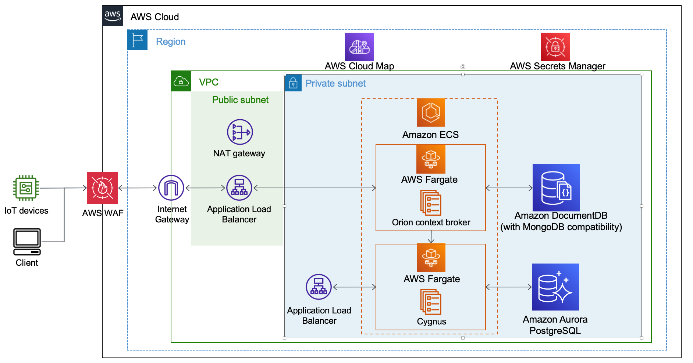

# FIWARE: Orion and Cygnus on AWS

This guide will help you to deploy Fiware's Orion and Cygnus (optional) components into a serverless architecture.

## What does this repository include?

1. An [AWS CDK](https://aws.amazon.com/cdk/) project in charge of provisioning the basic infrastructure with a VPC Network, Security Groups and two managed Databases, one Amazon Aurora Serverless (PostgreSql) and one Amazon DocumentDB. These are represented in the following stacks:

    - Network Stack
    - DocumentDB Stack
    - Aurora Stack
    - Fiware Stack (new stack replacing the deprecated docker ecs-integration)

## What doesn't this repository include?

Besides [WAF](https://aws.amazon.com/waf/) configuration to allow IP based access, this repository does not include any additional security mechanisms. However, we do recommend to read the [security considerations from Fiware](https://fiware-orion.readthedocs.io/en/master/user/security.html) and enable SSL communication. For the later, please read [create-https-listener](https://docs.aws.amazon.com/elasticloadbalancing/latest/application/create-https-listener.html) and how to enable this in [CDK](https://docs.aws.amazon.com/cdk/api/v2/docs/aws-cdk-lib.aws_ecs_patterns.ApplicationLoadBalancedFargateService.html#certificate)

## Architecture

## How to use it?

### 1. Requirements

Instal node v18.16.1 or greater.

### 2. Infrastructure

1.1 Create an [AWS profile](https://docs.aws.amazon.com/cli/latest/userguide/cli-configure-profiles.html) is recommended if you do not have it.

### 3. Configuring settings

Use the `settings.ts` file to configure your deployment. You can delete/comment the `cygnus` attribute if you only want to deploy Fiware Orion. You can also choose to deploy the 'fiware/orion' image or the 'fiware/orion-ld' from docker hub by configuring the `orionLD` attribute.

Additionally in the Orion construct you can add environmental variables, for more information check the following links:

- Orion: <https://fiware-orion.readthedocs.io/en/master/admin/cli.html#configuration-using-environment-variables>

- Orion-LD: <https://hub.docker.com/r/fiware/orion-ld>

### 4. Deployer script

The infrastructure is deployed by this bash script:

`./deployer.sh <YOUR_AWS_PROFILE>`

After the deployment is completed, you can see these services running in you AWS account.

| AWS Service                     | Description                                 |
| ------------------------------- | ------------------------------------------- |
| AWS Fargate                     | Containers for Orion and Cygnus             |
| Application Load Balancer (ALB) | Load Balancer for Orion and Cygnus web api. |
| Amazon DocumentDB               | Database for Orion                          |
| Amazon Aurora Serverless        | Database for Cygnus                         |
| AWS WAF                         | Web Application Firewall for the ALB. \*    |

**NOTE**: WAF rules for the ALBs can be changed, please see this [reference](https://docs.aws.amazon.com/waf/latest/developerguide/aws-managed-rule-groups-list.html).

### 5. Demo

Follow the demo from the published blog: [How to build smart cities with FIWARE Orion Context Broker and Cygnus on AWS](https://aws.amazon.com/blogs/publicsector/how-to-build-smart-cities-with-fiware-orion-context-broker-and-cygnus-on-aws/)

## 6. Load Testing

[Loadtest for FIWARE Components](https://github.com/FIWARE/load-tests) provides load test for FIWARE Orion-LD

## 7. Clean up

If you need to clean up the resources, please follow steps below.

**[WARN] All data will be deleted by this step.**

`npm run cdk destroy -- --all --profile <YOUR_AWS_PROFILE>`

## 8. Known Issues

### 8.1 DocumentDB vs MongoDB

- [Issue in FIWARE github repository](https://github.com/telefonicaid/fiware-orion/issues/3778)
- DocumentDB does not port all the functions of MongoDB, like for example geospatial capabilities.

### 8.2 Docker ECS integration deprecation

`Docker Compose's integration for ECS and ACI is retiring in November 2023.` from <https://docs.docker.com/cloud/ecs-integration/>

You can upgrade your current existing deployment by following these steps:

> IMPORTANT: we recommend you to do a full backup of the database services Aurora RDS and Amazon DocumentDB before continuing.

1. Edit the `settings.ts` file to configure your ECS services and WAF settings.
2. Delete the `cygnus` and `orion` stacks from the [AWS Console Cloudformation](https://console.aws.amazon.com/cloudformation), be sure to select the region used to deploy.
3. Execute the deployer in your terminal: `./deployer.sh <YOUR_AWS_PROFILE>`
4. You will get a new endpoint for Orion, `FiwareStack.orionservice...: http://....elb.amazonaws.com/`
5. If you deployed with Cygnus, you can subscribe to it in the new URL: `<http://cygnus.fiware:5055/notify>`

## License

This project is licensed under the GPL v3 License. See the [LICENSE](LICENSE) file.This library is licensed under the GPL v3 and the MIT-0 License. See the [LICENSE.MIT-0](LICENSE.MIT-0) file.
