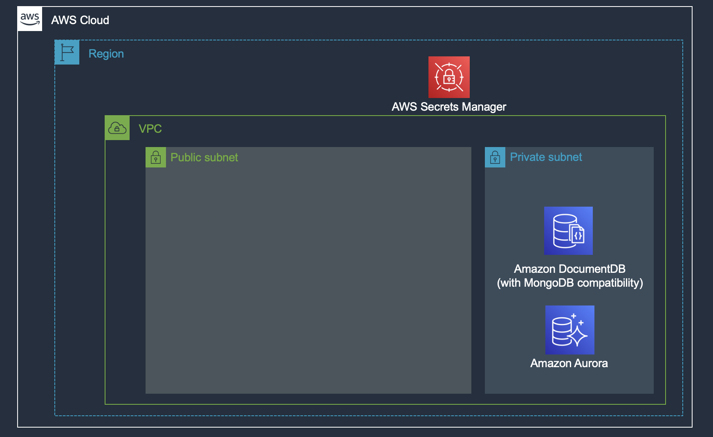
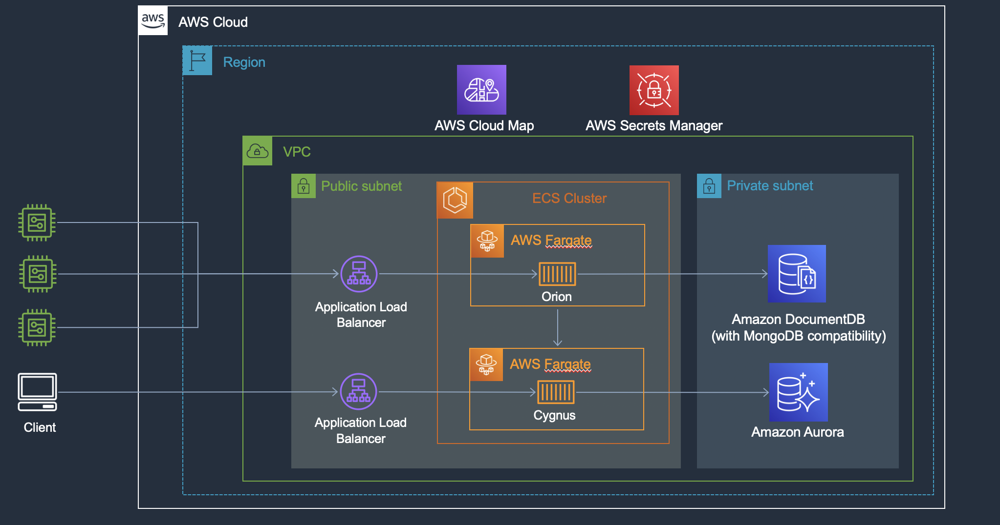

# FIWARE: Orion and Cygnus on AWS

This guide will help you to deploy Fiware's Orion and Cygnus components into a serverless architecture.

## What does this repository include?

1. An [AWS CDK](https://aws.amazon.com/cdk/) project in charge of provisioning the basic infrastructure with a VPC Network, Security Groups and two managed Databases, one Amazon Aurora Serverless (PostgreSql) and one Amazon DocumentDB. These are represented in the following stacks:

    - Network Stack
    - DocumentDB Stack
    - Aurora Stack

2. A docker-compose generator to provisioning AWS ECS Fargate instances, ALBs with Firewall WAF rules. This is a nodeJS script that runs after the CDK and it will automatically generate two docker-compose one for each service.

## Architecture

- First, this architechture is deployed with AWS CDK as follows.



- Finally, the architecture is deployed with Docker Compose CLI as follows.



## How to use it?

### 1. Infrastructure

Deploy Infrastructure. Firstly, creating an [AWS profile](https://docs.aws.amazon.com/cli/latest/userguide/cli-configure-profiles.html) is recommended if you do not have it.

### 2. Configuring WAF for ALB

Security is very important and out of the box, the service is blocking all connections to the service. You need to add your public IP to AWS WAF for the Orion service ALB (Application Load Balancer). You can use the included [waf.json.sample](./waf.json.sample) file that shows how to configure `denylist` and `allowlist`.

The deploy script will generated a docker-compose file that includes CloudFormation entries with [IPSetReferenceStatement](https://docs.aws.amazon.com/AWSCloudFormation/latest/UserGuide/aws-properties-wafv2-webacl-ipsetreferencestatement.html), and [Rate-based rule statement](https://docs.aws.amazon.com/AWSCloudFormation/latest/UserGuide/aws-properties-wafv2-webacl-ratebasedstatement.html) under the `WebACL` resource in the `x-aws-cloudformation` property for the firewall configuration.

You should start by copying the sample file, then you edit your settings in your own waf.json

```bash
cp waf.json.sample waf.json

```

If your `allowlist` is an empty array `[]`, your endpoint will be `public` and this message will be showed while deploying:

```bash
[WARN] WAF Allow list is empty, this makes the service to be public

```

You can edit the `waf.json` file anytime, but you will have to run the `docker compose` command again to update the service as needed.

### 3. Deployer script

#### 3.1 Prerequisites

Instal node v18.16.1 or greater.

#### 3.2 Provisioning

The basic infrastructure and the docker-compose generator are executed by this bash script:

`$./deployer.sh <AWS_PROFILE>`

After the deployment is completed, you can see these services running in you AWS account.

| AWS Service                     | Description                                 |
| ------------------------------- | ------------------------------------------- |
| AWS Fargate                     | Containers for Orion and Cygnus             |
| Application Load Balancer (ALB) | Load Balancer for Orion and Cygnus web api. |
| Amazon DocumentDB               | Database for Orion                          |
| Amazon Aurora Serverless        | Database for Cygnus                         |
| AWS WAF                         | Web Application Firewall for the ALB. \*    |

**NOTE**: WAF rules for the ALBs can be changed, please see this [reference](https://docs.aws.amazon.com/waf/latest/developerguide/aws-managed-rule-groups-list.html).

### 4. Start Orion and Cygnus services

#### 4.1 Prerequisites

1. Install [docker](https://docs.docker.com/cloud/ecs-integration/).
2. Create or select a docker context for the FIWARE orion environment.

```bash
$ docker context create ecs <context-name>
? Create a Docker context using: [Use arrows to move, type to filter]
  > An existing AWS profile  <- Note: Select this to use the AWS profile you created.

$ docker context use <context-name>
```

#### 4.2 Deploy FIWARE Orion and Cygnus using Docker ECS integration

These docker files are build using the [Docker ECS integration](https://docs.docker.com/cloud/ecs-integration/), please check the link for more information.

To deploy, please run:

1. Orion: `docker compose -p orion -f docker/orion/docker-compose.yml up`

2. Cygnus: `docker compose -p cygnus -f docker/cygnus/docker-compose.yml up`

After deploying, you can get the services endpoint by running:

`docker compose --project-name orion ps`
`docker compose --project-name cygnus ps`

As an example, you can create an `entity` by using curl:

```js
curl --request POST \
  --url http://orion-alb-<aws_account>.<aws_region>.elb.amazonaws.com:1026/v2/entities \
  --header 'Content-Type: application/json' \
  --header 'fiware-service: demo' \
  --header 'fiware-servicepath: /' \
  --data '{
 "id": "living",
 "type": "Room",
 "temperature": {"value": 23, "type": "Float"}
}'
```

## 5. Testing

[Loadtest for FIWARE Components](https://github.com/FIWARE/load-tests) provides load test for FIWARE.

## 6. Clean up

If you need to clean up the resources, please follow steps below.

### 6.1 Delete the FIWARE services

Orion: `docker compose -p orion down`

Cygnus: `docker compose -p cygnus down`

### 6.2 Deprovision Infrastructure

**[WARN] All data will be deleted by this step.**

`npm run cdk destroy -- --all --profile <AWS_PROFILE>`

## 7. Additional Topics

### 7.1 MongoDB as context database for Orion

If you have a MongoDB cluster, like [Atlas](https://www.mongodb.com/cloud/atlas), you can edit the [docker-compose](./docker/orion/docker-compose.yml.sample) file for orion with these options:

- dbhost
- rplSet
- dbuser
- dbpwd

```yaml
command: ...
  /usr/bin/contextBroker -fg -multiservice -ngsiv1Autocast -disableFileLog -dbhost <MontoDB Atlas cluster's endpoint array including 27017 port> -rplSet <MontoDB Atlas replica set shard name> -dbuser <MontoDB Atlas user> -dbpwd <MongoDB Atlas password> -dbDisableRetryWrites -logLevel $${ORION_LOGS_LEVEL}
```

Replace parameter values for Orion below with ones MongoDB Atlas provided.

### 7.2 Useful docker compose cli command

#### Logs

To get the application logs.

```bash
docker compose --project-name <project name> logs
```

#### Service status

To get service information deployed on ECS.

```bash
docker compose --project-name <project name> ps

#Example
NAME                                          SERVICE             STATUS              PORTS
task/orion/a6033a645faa4cd89c474ba950188ff5   orion               Running             orion-alb-XXXXXXXXXX.us-east-1.elb.amazonaws.com:1026->1026/http
task/orion/d869b3ca63b241c0801c46488d3791ba   orion               Running             orion-alb-XXXXXXXXXX.us-east-1.elb.amazonaws.com:1026->1026/http

```

#### CloudFormation

To transform docker-compose.yml into a CloudFormation template.

```bash
docker compose --project-name <project name> convert

#Example
AWSTemplateFormatVersion: 2010-09-09
Resources:
  CloudMap:
    Properties:
      Description: Service Map for Docker Compose project ecs-text
      Name: ecs-text.local
      Vpc: vpc-cd1d32b6
    Type: AWS::ServiceDiscovery::PrivateDnsNamespace
  Cluster:
    Properties:
      ClusterName: ecs-text
      Tags:
        - Key: com.docker.compose.project
          Value: ecs-text
    Type: AWS::ECS::Cluster
...

```

## 8. Testing

Follow the demo from the published blog: [How to build smart cities with FIWARE Orion Context Broker and Cygnus on AWS](https://aws.amazon.com/blogs/publicsector/how-to-build-smart-cities-with-fiware-orion-context-broker-and-cygnus-on-aws/)

## 9. Known Issues

### DocumentDB vs MongoDB

- [Issue in FIWARE github repository](https://github.com/telefonicaid/fiware-orion/issues/3778)
- DocumentDB does not port all the functions of MongoDB, like for example geospatial capabilities.

## License

This project is licensed under the GPL v3 License. See the [LICENSE](LICENSE) file.This library is licensed under the GPL v3 and the MIT-0 License. See the [LICENSE.MIT-0](LICENSE.MIT-0) file.
